## Clocking In

Select the *'Clock In'* button to create a starting date/time.

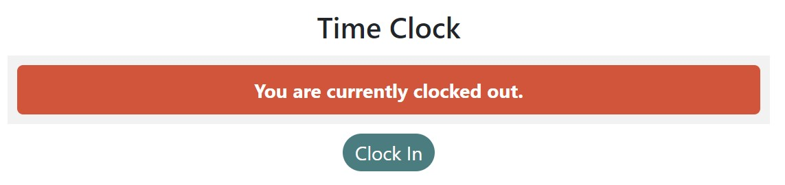{: width="400" }

 

## Clocking Out

After selecting the *'Clock In'* button, the user status will change to **'You are currently clocked in.'**. Select the *'Clock Out'* button to now create a finishing date/time.

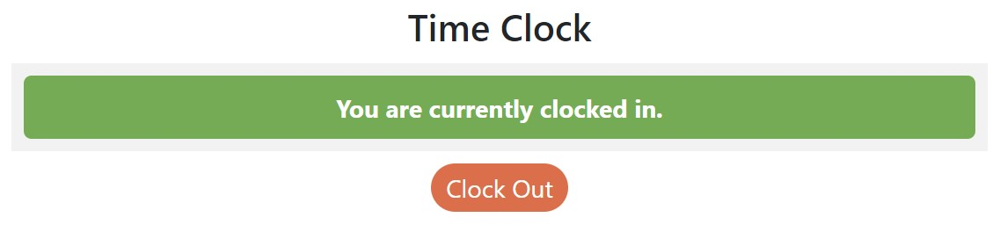{: width="400" }

 

After selecting the *'Clock out'* button, a new **Timesheet Entry** is created in the **Timesheet List** and the user status will change to **'You are currently clocked out.'**. Select a **Timesheet Entry** to view more details or make/request any changes to the entry.

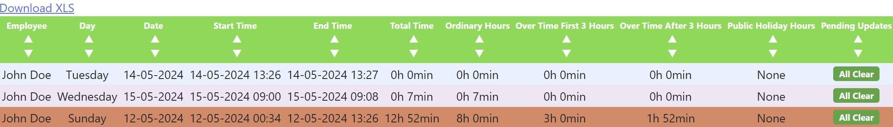{: width="800" }

 

## Requesting Changes

The **Timesheet Details** summary displays an overview of the selected **Timesheet Entry** information.

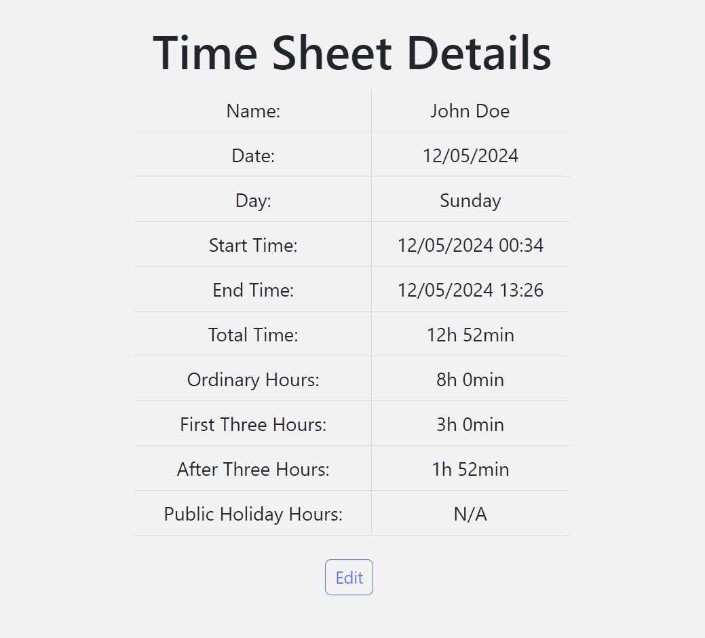{: width="400" }

 

If any changes need to be made to a **Timesheet Entry**, select the *'Request Update'* button.

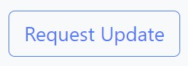{: width="200" }

 

### Requesting Timesheet Update

After selecting the *'Request Update'* button, a **Request Timesheet Update** window will allow you to input information for the change request. After the new details have been inputted, select the *'Submit Request'* button.

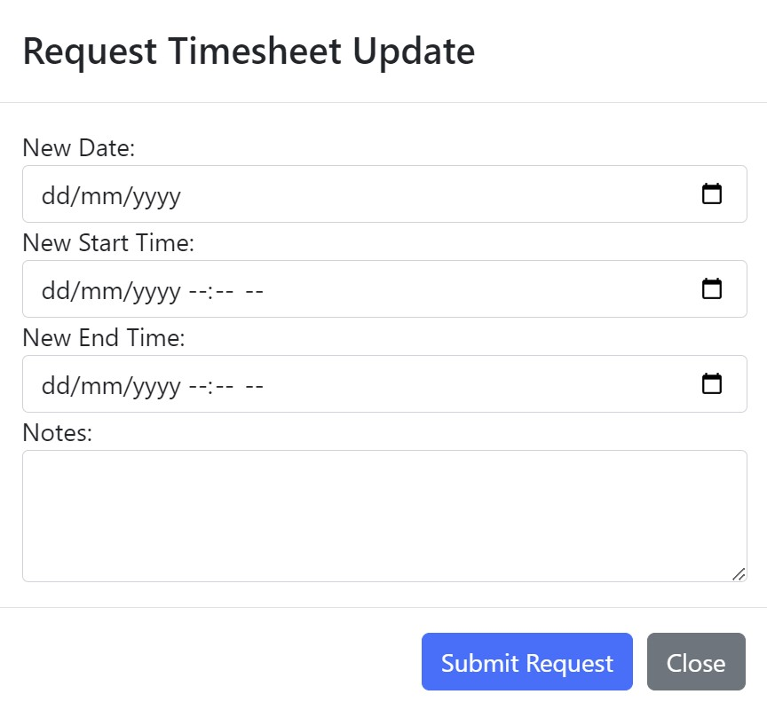{: width="400" }

- :calendar: **New Date:** The new date for the working day.

- :calendar: **New Start Time:** The new starting date/time.

- :calendar: **New End Time:** The new finishing date/time.

- **Notes:** A brief description/reason for the changes to be made.

 

### Update Requests

After selecting the *'Submit Request'* button, a new **Update Request Entry** is created in the **Update Requests List**

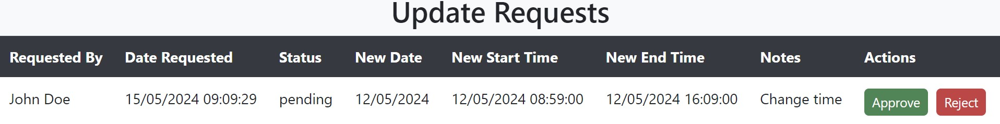{: width="800" }

- **Requested By:** The user who requested the change.

- **Date Requested:** The date when the change request was created.

- **Status:** The current status of the change request.

- **New Date:** The requested new date for the working day.

- **New Start Time:** The requested new starting date/time.

- **New End Time:** The requested new finishing date/time.

- **Notes:** A brief description/reason for the changes to be made.

- **Actions:** Buttons for :necktie: **Administration** and :memo: **Accounts** users to approve or reject the request.

 

Once a change request has been submitted, the **Pending Updates** column in the **Timesheet List** will update to **'Pending Updates'**.

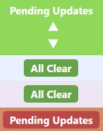{: width="150" }

!!! info "Pending Updates"
    By default, a <b>Timesheet Entry</b> will display <b>'All Clear'</b> until a change request is made. 

 

## Creating Changes

Select the *'Edit'* button underneath the **Timesheet Details** summary to make a direct change to a **Timesheet Entry**. 

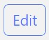{: width="80" }

!!! question "What User Groups Can See This?"

    Only :necktie: <b>Administration</b> and :memo: <b>Accounts</b> users can make changes.

 

### Edit Details

After selecting the *'Edit'* button, an **Edit Details** window will allow you to input information to make a direct change to the **Timesheet Entry**. After the new details have been inputted, select the *'Save'* button to save and apply the changes to the **Timesheet Entry**.

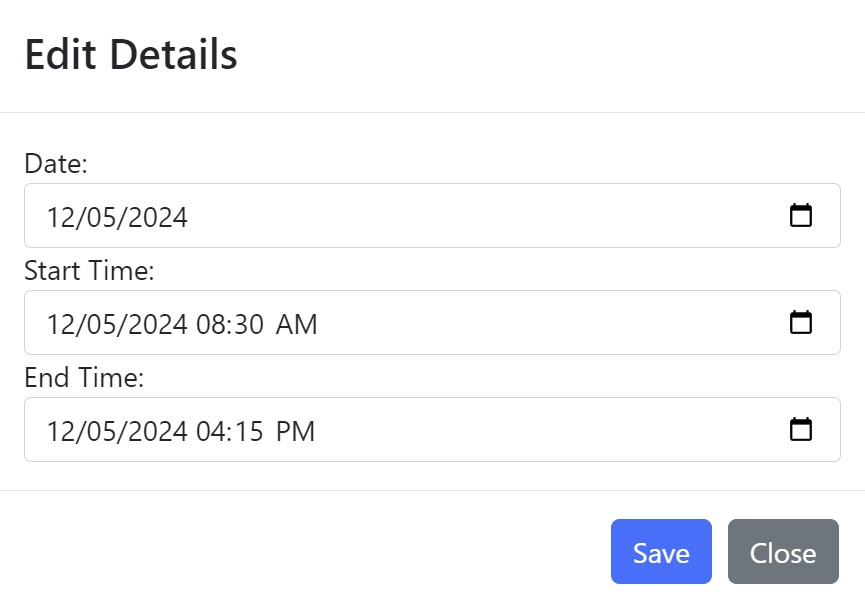{: width="400" }

- :calendar: **Date:** Change the date.

- :calendar: **Start Time:** Change the starting date/time.

- :calendar: **End Time:** Change the finishing date/time.

 

### Approving/Rejecting Changes

If an **Update Request Entry** exists for the **Timesheet Entry** it will appear in the **Update Requests List** with an **Actions** column containing an *'Approve'* and *'Reject'* button. The *'Approve'* button will apply the request changes to the **Timesheet Entry** and the **Status** will be changed to **Approved**. The *'Reject'* button will deny the request changes and the **Status** will be changed to **Rejected**.

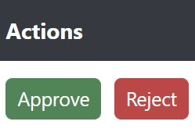{: width="200" }

!!! question "What User Groups Can See This?"

    Only :necktie: <b>Adminstration</b> and :memo: <b>Accounts</b> users can view this.
    
 

## Search Filters

Users with the relevant permissions can filter by **Employee** when viewing the **Timesheet List**. Select the dropdown menu to reveal a search field and begin typing to search for an **Employee**.

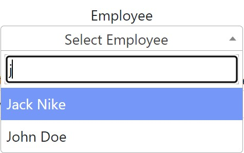{: width="300" }

!!! question "What User Groups Can See This?"

    Only :necktie: <b>Adminstration</b> and :memo: <b>Accounts</b> users can view this.

 

Filter by date using the **Start Date** and **End Date** to make navigating and finding a specific **Timesheet Entry** easier. When the filters have been defined, select the *'Apply Filter'* button to apply the filters to the **Timesheet List**. Remove any information entered into the filters by selecting the *'Clear Filter'* button.

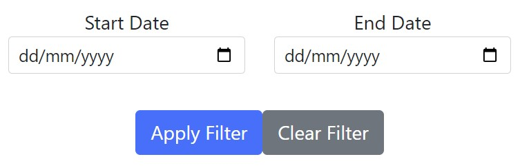{: width="400" }

 

## Exporting Timesheets

Select the *'Download XLS'* button to download the **Timesheet List**. Timesheets can be exported into a .XLSX format to allow the data to be viewed in programs such as **Microsoft Excel** or **Google Sheets**.

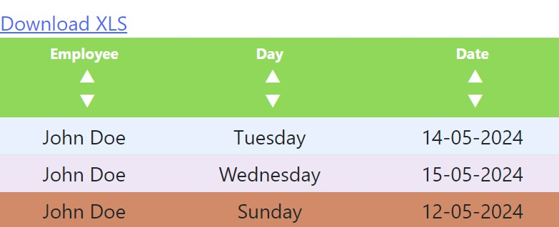{: width="400" }

 

