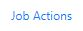
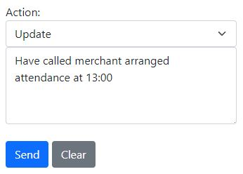
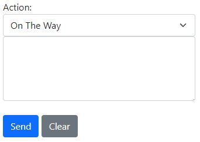
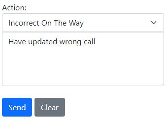
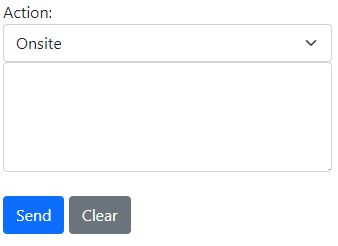

# Job Details

## Job Actions

The **Job Actions** tab shows all the latest updates for the current job. You can use this tab to add important notes that all staff need to see.

#### Update

To send an update regarding the current job, simply type your message in the input field and click 'Send'. This will update the live message feed displayed below.

    
Action Status

    

        Action Status Update
        <ul>
            <li>Please note that you can send updates regardless of the **Action Status** selected; it is not necessary for it to be set to 'update' for this action to occur.</li>
        </ul>
    

#### On The Way

You can use the dropdown menu to set your current status to "On The Way" This notifies the Helpdesk and other relevant parties that you are en route to the job.

If you accidentally set your status to "On The Way" you can select the "Incorrect On The Way" status to remove yourself from this status. You will also need to enter a message explaining the situation.

#### On Site

You can use the dropdown menu to set your current status to "On Site" This notifies the Helpdesk and other relevant parties that you are at site.

If you accidentally set your status to "Onsite" you can select the "Incorrect Onsite" status to remove yourself from this status. You will also need to enter a message explaining the situation.

