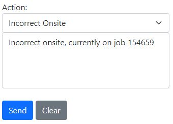
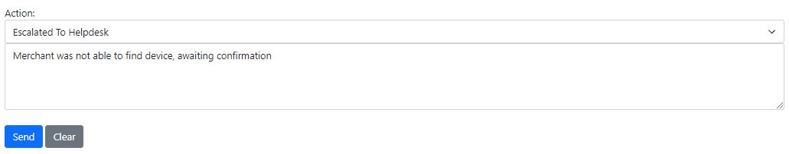
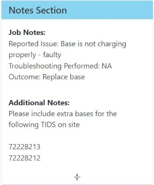

# Job Details

## Job Details Summary

- **Job Number:** A unique number used to identify jobs within the system.
- **Site Name:** The name of the site/business name given by the merchant.
- **Client Call Number:** A unique external job number used by the clients system.
- **Client Details:** The name of the client and nature of the job.
- **Job Type:** The nature of the job or type of work to be carried out.
- **Primary Technician:** The primary technician that has been allocated to the job.
- **Second Technician:** If needed, a secondary technician that has been allocated to the job will appear here.
- **Call Status:** This shows the current status of the job.
- **Client Job URL:** This link will take you to the corresponding job within the clients system.
    +   This will require secure login details from the clients system.
- **Address:** The job site address given by the merchant. Click this field for directions with Google Maps.

 

## Job Actions - Tab

The **Job Actions** tab shows all the latest updates for the current job. You can use this tab to add important notes that all staff need to see.
 

 

### Actions
#### Update

To send an update regarding the current job, simply type your message in the input field and click *'Send'*. This will update the live message feed displayed below.

    
Action Status

    

        Action Status Update
        <ul>
            <li>Please note that you can send updates regardless of the **Action Status** selected; it is not necessary for it to be set to 'update' for this action to occur.</li>
        </ul>
    

 

#### On The Way

You can use the dropdown menu to set your current status to *'On The Way'* This notifies the Helpdesk and other relevant parties that you are en route to the job.

 

If you accidentally set your status to *'On The Way'* you can select the *'Incorrect On The Way'* status to remove yourself from this status. You will also need to enter a message explaining the situation.

 

#### On Site

You can use the dropdown menu to set your current status to *'On Site'* This notifies the Helpdesk and other relevant parties that you are at site.

 

If you accidentally set your status to *'Onsite'* you can select the *'Incorrect Onsite'* status to remove yourself from this status. You will also need to enter a message explaining the situation.

 

### Button Actions
#### Technician Actions

If the job call is presently not onsite, you will notice a *'Technician Actions'* button below the **Action Update**. This button provides various options for the user.

- **Escalate To Helpdesk:** This option permits the user to escalate the call to the Helpdesk if there is an issue that requires further attention.
- **Close Call:** This option enables the user to close the call once it has been completed.

 

#### Onsite Actions

If the job call is currently onsite, you will find an *'Onsite Actions'* button below the **Action Update**. This button offers various options for the user.

- **Create Closure Note:** This allows you to submit closure notes for your current attendance. This must be used at all times when you have been onsite.
- **Escalate To Helpdesk:** This choice allows the user to escalate the call to the Helpdesk if there is an issue that requires further attention.
- **Leaving Site:** After completing all other actions and if the call needs to remain open but nothing needs to be escalated, you can leave the site.
- **Close Call:** This enables the user to close the call once it has been completed.

 

##### Create Closure Note

When you arrive onsite, you will see the *'Create Closure Note'* option. Use this to document each visit, recording all relevant onsite and offsite details along with the outcomes of your attendance.

After clicking this button, you will be directed to another page where you can enter all the necessary details. Please be aware that the fields in the note are adjustable, as administrators have the capability to modify closure notes for each client and contract.

 

Once the closure note has been submitted it will post an update on the **Job Actions** tab.

 

All closure notes that have been submitted for a job can be found under the **Closure Notes** tab.

 

##### Escalate to Helpdesk

If the call requires to be escalated to the help desk, you are able to click the *'Escalate to Helpdesk'* button. A pop-up window will show to advise if you would like to escalate to helpdesk.

 

A second pop-up will prompt you to enter a message in the **Action Update Field**.

 

Enter required message to helpdesk.

    
Escalation Email

    

        Automatic Email
        <ul>
            <li>Please note when a call has been escalated, an automatic escalation email has been sent to the helpdesk.</li>
        </ul>
    

 

## Job Details - Tab

The **Job Details** tab will present all information regarding the current job.

 

### Details

The job details will always align with the current **Client** and **Client Contract**. The displayed information will vary depending on the selections made by the administration team.

 

### Notes Sections

This will show the job notes, which include the site issue as well as any additional notes that may be important.

 

### SLA Details

You can view the **SLA Details** to see the remaining duration for each job.

- **Attend By SLA:** This indicates the time remaining to attend to the site.
- **Close By SLA:** This timer displays the time available before the call must be resolved.

 

### Site Details

All location and contact information can be found under the **Site Details** section.

 

### File Uploads & Image Uploads

You have the capability to upload **Files** and **Images**. Simply click on the *'Choose Files'* button to select the desired files or images, then proceed to hit the upload button.

    
Uploads

    

        Files and Images Upload:
        <ul>
            <li>Please note that you can only upload either Files or Images at a time. Once you have selected what you need, click the upload button. Wait for the progress bar to complete and the page to refresh.</li>
        </ul>
    

 

## Closure Notes - Tab

The **Closure Notes** tab will show all closure notes created for a job.

 

Click the closure note to reveal a drop-down section with more information.

 

