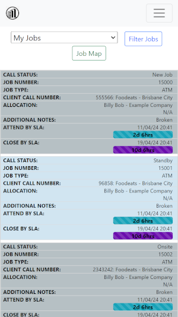
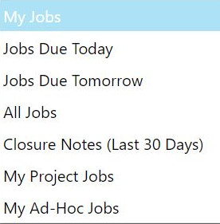
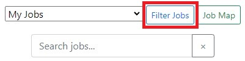
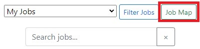
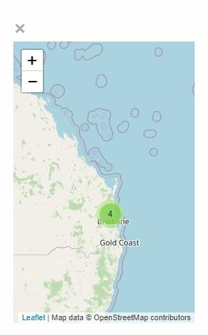
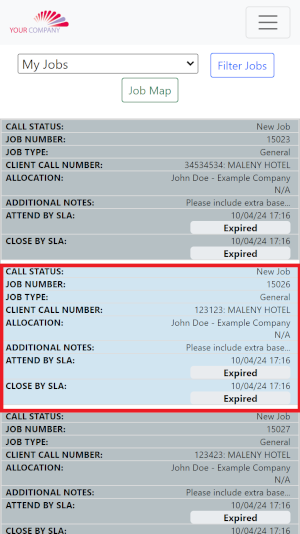

# Technican Job List

## Job List

This list displays all current jobs assigned to you, showcasing all relevant details for each entry.

{: .img}

- **Call Status:** This shows the current status of the job.

- **Job Number:** A unique number used to identify jobs within the system.

- **Job Type:** The nature of the job or type of work to be carried out.

- **Client Call Number:** A unique external job number used by the clients system.

- **Allocation:** This displays the primary technician and secondary technician if allocated

- **Attend By SLA:** This indicates the time remaining to attend to the site.

- **Close By SLA:** This timer displays the time available before the call must be resolved.

 

## Filters

We are able to change what we can see in our job list by adjusting our job filters, there is a few options available. 

- **Jobs Due Today**

- **Jobs Due Tomorrow**

- **All Jobs**

- **Closure Notes (Last 30 Days)**

- **My Project Jobs**

- **My Ad-Hoc Jobs**

 

Once you have selected your filter, click the *'Filter Jobs'* button.

 

## Maps

Once you select a search filter, you can click on the *'View Map'* button to display a map showing all job locations associated with your name, based on the selected filter.

 

The **Job Map** will show the filtered current jobs in your area and associated with your name.

 

## View Job Information

If you want to view the detailed breakdown of a specific job, you can click the **Job Row**, and you will be redirected to the **Job Details** page.

 

