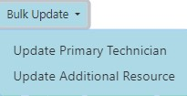
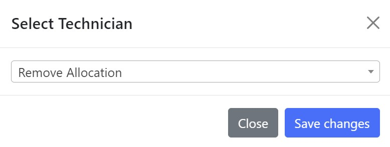
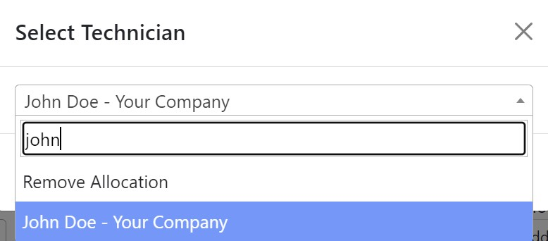
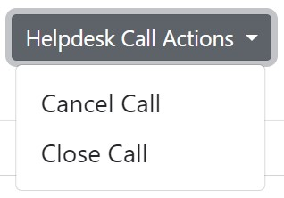
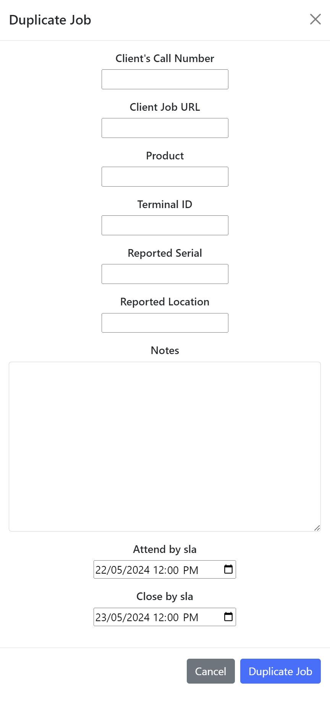

## Bulk Update Allocation

Perform a bulk update by selecting jobs from the job list using the selection column. Bulk updates can be used to update the primary and/or secondary technician for multiple jobs in one action.

{: width="250" }

- **Update Primary Technician:** Change the primary technician in the dropdown menu.

- **Update Additional Resource:** Change the secondary technician.

!!! question "What User Groups Can See This?"

    Only :necktie: <b>Adminstration</b> and :telephone: <b>Helpdesk</b> users can view this.

 

### Select Technician

After selecting *'Update Primary Technician'* or *'Update Additional Resource'* a **Select Technician** window will prompt you to allocate a technician.

{: width="400" }

!!! info "Removing An Allocation"
    By default, <b>'Remove Allocation'</b> is selected to remove any technician allocations made for the selected jobs in the bulk update.

 

Select the dropdown menu to reveal a search field and begin typing to search for a **Technician**.

{: width="400" }

 

## Job Details

### Button Actions

#### Helpdesk Call Actions

{: width="250" }

!!! question "What User Groups Can See This?"

    Only :necktie: <b>Administration</b> and :telephone: <b>Helpdesk</b> users can use the <b>'Helpdesk Call Actions'</b> button.

 

#### Duplicate Job

A job can be duplicated by selecting the *'Duplicate Job'* button.

{: width="200" }

!!! question "What User Groups Can See This?"

    Only :necktie: <b>Administration</b> and :telephone: <b>Helpdesk</b> users can use the <b>'Duplicate Job'</b> button.

 

After selecting the *'Duplicate Job'* button, the **Duplicate Job** window will appear. This can be used to duplicate the selected job and populate it with ^^different^^ details.

{: width="400" }

- **Client's Call Number:** A unique external job number used by the clients system.

    + !!! warning "This field must be filled."

- **Client Job URL:** A link to take you to the corresponding job within the clients system.

- **Product** The product name or model.

- **Terminal ID:** The Terminal ID (TID) registered

- **Reported Serial:** 

- **Reported Location:**

- **Notes:** Any information relating to the job.

    + !!! warning "This field must be filled."

- **Attend By SLA:** This indicates the date and time remaining to attend to the site.

- **Close By SLA:** This timer displays the date and time available before the call must be closed.

 

## Job Details - Tab

### Job Details

### Notes

### SLA Details

### Site Details

#### Change Site Details

### Admin Details
