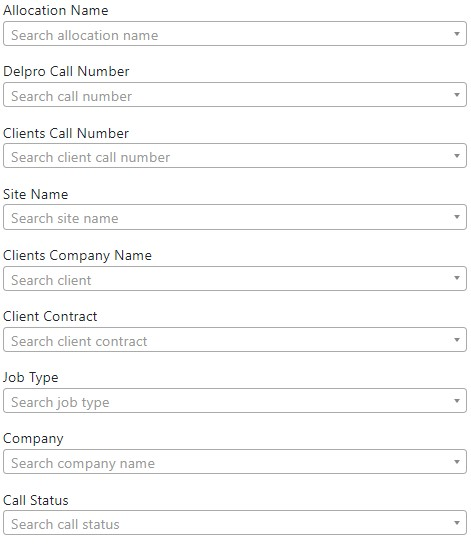
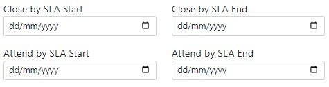
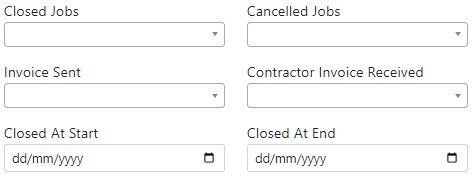
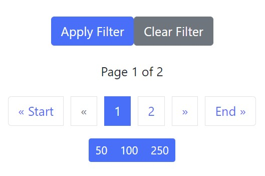
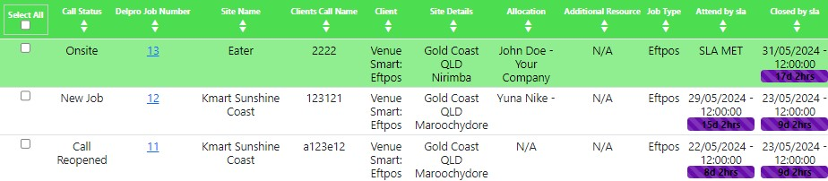

## Filters

### Search Fields

These search fields allow you to type user specified information.

- **Allocation Name:** Search the allocated client or user login.

- **Delpro Call Number:** Search a unique number used to identify jobs within the system.

- **Client Call Number:** Search a unique external job number used by the clients system.

- **Site Name:** Search the name of the site/business name given by the merchant.

- **Clients Company Name:** Search a list of clients within the system.

- **Client Contract:** Search by the type of contract.

- **Job Type:** Search by the nature of the job or type of work to be carried out.

- **Company:** Search for a company name.

- **Call Status:** Search jobs by the current status.

 

### SLA Fields

The SLA fields allow you to filter jobs by a date and time specified for the **Attend By SLA** and **Close By SLA** fields.

- :calendar: **Close by SLA Start:** Search ^^from^^ a close by SLA date/time.

- :calendar: **Close by SLA End:** Search ^^until^^ a close by SLA date/time.

- :calendar: **Attend by SLA Start:** Search ^^from^^ an attend by SLA date/time.

- :calendar: **Attend by SLA End:** Search ^^until^^ an attend by SLA date/time.

 

### Additional Fields

These fields allow you to filter by specific conditions or parameters.

- **Closed Jobs:** Search for any jobs that have been closed.

    +   Select :white_check_mark: True or :x: False

- **Cancelled Jobs:** Search for any jobs that have been cancelled.

    +   Select Not Cancelled or Cancelled

- **Invoice Sent:** Search any jobs that have been closed.

    +   Select :white_check_mark: True or :x: False

- **Contractor Invoice Required:**

    +   Select :white_check_mark: True or :x: False

- :calendar: **Closed At Start:** Search ^^from^^ a job closed date/time.

- :calendar: **Closed At End:** Search ^^until^^ a job closed date/time.

 

### Search Filters

Select *'Apply Filter'* to search the job list with the defined filters. Use the *'Clear Filter'* button to clear any changes made to the search filters.

Use the page navigation section when the job list exceeds the selected amount of jobs to show per page. This can be changed by selecting **50**, **100**, or **250**.

{: width="300" }

 

## Job Search Results

After inputing the relevant filters, the **Job Search Results** are defined in the **Job List** underneath the filters section. Select the head of a table column name to sort information by ascending/descending order for a specific field. 

The first column is used to select one or more jobs by selecting checkboxes or selecting *'Select All'* at the head of the column.

- **Call Status:** This shows the current status of the job.

- **Job Number:** A unique number used to identify jobs within the system.

- **Site Name:** The name of the site/business name given by the merchant.

- **Client Call Number:** A unique external job number used by the clients system.

- **Client Details:** The name of the client and nature of the job.

- **Site Details:** The state, city, and suburb details given for the job.

- **Allocation:** The primary technician that has been allocated to the job.

- **Additional Resource:** If needed, a secondary technician that has been allocated to the job will appear here.

- **Job Type:** The nature of the job or type of work to be carried out.

- **Attend By SLA:** This indicates the date and time remaining to attend to the site.

 

