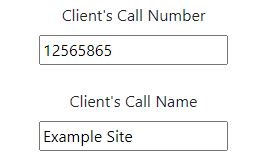

# Documentation

## Helpdesk

### Creating Jobs

To initiate the job creation process, navigate to the Helpdesk button located in the navigation bar. Subsequently, click on the Create Job button which will direct you to the job creation form.

Upon accessing the form, you'll need to specify the client and their corresponding contract for whom the job is being created. If the desired client is not visible in the dropdown menu, please refer to the administration for assistance as it may need to be added.

Additionally, two extra fields will appear prompting you to input the Client's Call Number and Client Call Name. If the client lacks either of these details, kindly consult the administration for further guidance.

