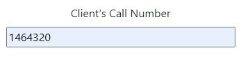

# Helpdesk

### Creating Jobs

To initiate the job creation process, navigate to the Helpdesk button located in the navigation bar. Subsequently, click on the Create Job button which will direct you to the job creation form.

Upon accessing the form, you'll need to specify the client and their corresponding contract for whom the job is being created. If the desired client is not visible in the dropdown menu, please refer to the administration for assistance as it may need to be added.

Additionally, one extra fields will appear prompting you to input the Client's Call Number. If the client lacks this detail, kindly consult the administration for further guidance.

### Site Details

Each **Client** and **Client Contact** will have **Site Details** attached to them these are all specififc. The site details will only show if the above **Client** and **Client Contact** has been selected. Think of the **Site Details** as the location of the site. 

If the **Site Details** does not show in the least we are able to create one please select *If a site does not exist, click here* this will open another window that will allow us to enter new **Site Details**

