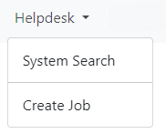
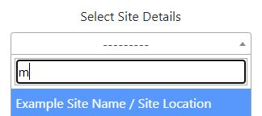
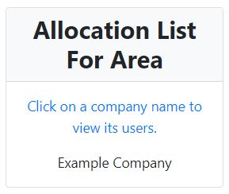
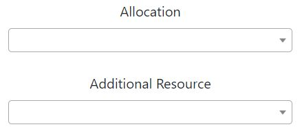
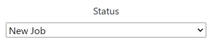
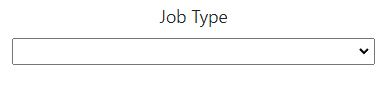
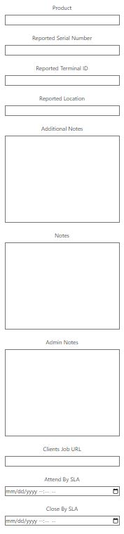

<!DOCTYPE html>
<html lang="en">
<head>
    <meta charset="UTF-8">
    <meta name="viewport" content="width=device-width, initial-scale=1.0">
    <title>Helpdesk Documentation</title>
    
</head>
<body>

    <h1>Helpdesk</h1>
    <!-- Content of Helpdesk section -->

    <h2>Creating Jobs</h2>
    <!-- Content of Creating Jobs section -->
    
To initiate the job creation process, navigate to the Helpdesk button located in the navigation bar. Subsequently, click on the Create Job button which will direct you to the job creation form.

    
    <!-- Additional content for Creating Jobs -->

    <h2>Site Details</h2>
    <!-- Content of Site Details section -->
    
For each <strong>Client</strong> and <strong>Client Contact</strong>, specific <strong>Site Details</strong> are linked, acting as the exact location for the site. These details are only visible once the respective <strong>Client</strong> and <strong>Client Contact</strong> have been chosen.

    
    <!-- Additional content for Site Details -->

    <h2>Job Allocation List</h2>
    <!-- Content of Job Allocation List section -->
    
After selecting a <strong>Site Details</strong>, the list below will populate with company names. Clicking on any company name will display all users associated with that company who are operating within the zone specified by the <strong>Site Details</strong>.

    
    <!-- Additional content for Job Allocation List -->

    <h2>Job Allocation</h2>
    <!-- Content of Job Allocation section -->
    
There are two sections where you can assign a job to a user, <strong>Allocation</strong> and <strong>Additional Resources</strong>. Ensure the user appears in the mentioned allocation list since this user falls within the designated area. If they should be included in that area, please inform the administration.

    
<strong>Automation:</strong> After a job is initiated, please be aware that emails will be dispatched to users who have been assigned the job.

    
    <!-- Additional content for Job Allocation -->

    <h2>Job Status</h2>
    <!-- Content of Job Status section -->
    
The default <strong>Job Status</strong> is set as <em>New Job</em>. If a different status is needed, please select the desired option from the drop-down menu. Below are examples of statuses you can choose:

    <ul>
        <li>Standby</li>
        <li>Awaiting Customer Reply</li>
        <li>Management Follow Up</li>
        <li>On Hold</li>
        <li>Parts Pending</li>
    </ul>
    
    <!-- Additional content for Job Status -->

    <h2>Job Type</h2>
    <!-- Content of Job Type section -->
    
The <strong>Job Type</strong> is a flexible field configured by administrators. It serves to identify the nature of the job or to distinguish it from other roles within the company as needed. If this field is blank, please consult with the administration, as filling it out is necessary for job creation.

    
    <!-- Additional content for Job Type -->

    <h2>Additional Fields</h2>
    <!-- Content of Additional Fields section -->
    
The fields presented below dynamically adjust, appearing or disappearing based on administrative preferences related to the logging of jobs, depending upon the specific <strong>Client</strong> and <strong>Client Contract</strong>. Whether these fields are visible or hidden, their necessity as mandatory or optional also varies in accordance with the <strong>Client</strong> and <strong>Client Contract</strong>.

    
Please see example fields below:

    
    <!-- Additional content for Additional Fields -->

</body>
</html>
