

# Helpdesk

## Creating Jobs

To initiate the job creation process, navigate to the Helpdesk button located in the navigation bar. Subsequently, click on the Create Job button which will direct you to the job creation form.

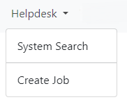

## Client and Client Contract

Upon accessing the form, you'll need to specify the **Client** and their corresponding contract for whom the job is being created. If the desired **Client** is not visible in the dropdown menu, please refer to the administration for assistance as it may need to be added.

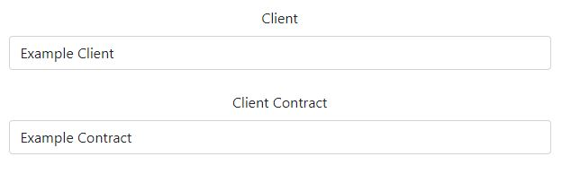

Additionally, one extra fields will appear prompting you to input the **Client's Call Number**. If the client lacks this detail, kindly consult the administration for further guidance.

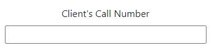

## Site Details

For each **Client** and **Client Contact**, specific **Site Details** are linked, acting as the exact location for the site. These details are only visible once the respective **Client** and **Client Contact** have been chosen.

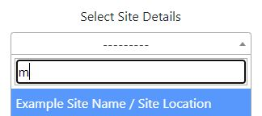

In the event that **Site Details** are not displayed in the list, there's an option to create a new entry. To do this, simply select *If a site does not exist, click here*. This will open a new window, facilitating the addition of new **Site Details**.

Kindly complete the new **Site Details** form with special attention to accurately entering essential information in the following fields:

 - **Site Name:** Specify the site's name, which identifies the location.
 - **Address:** Enter the complete physical address of the site.
 - **Zone:** Choose the zone from the list established by the administration that corresponds to the site's location. If the appropriate zone is not listed, please alert the administration. Note that zones determine job visibility for users, allowing them to see jobs within their specific zone.

**Important:** Should any required fields be left incomplete upon submission, you will receive a notification indicating which fields need to be filled.

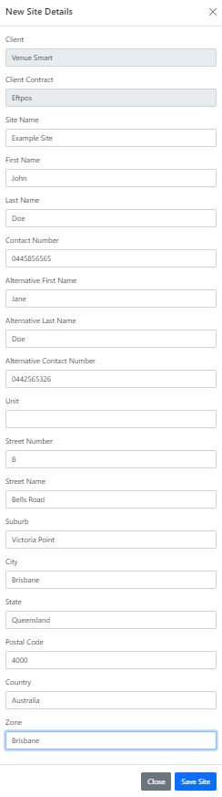

## Job Allocation List

After selecting a **Site Details**, the list below will populate with company names. Clicking on any company name will display all users associated with that company who are operating within the zone specified by the **Site Details**. Among these users, one will be labeled *"Main Account"* and highlighted in yellow. Please assign the job to this user, as recommended by the contracting company. If the main user is not visible, please notify administration.

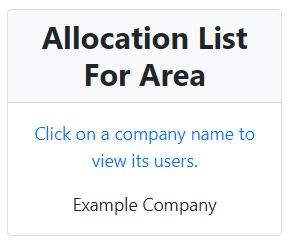

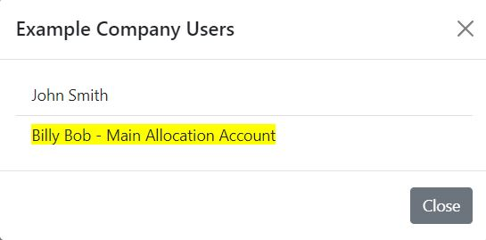

## Job Allocation

There are two sections where you can assign a job to a user, **Allocation** and **Additional Resources**. Ensure the user appears in the mentioned allocation list since this user falls within the designated area. If they should be included in that area, please inform the administration. 

**Automation:** After a job is initiated, please be aware that emails will be dispatched to users who have been assigned the job.

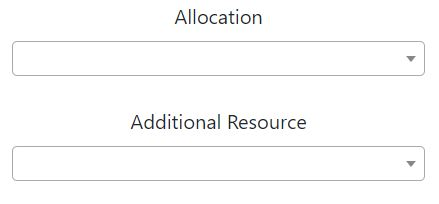

## Job Status

The default **Job Status** is set as *New Job*. If a different status is needed, please select the desired option from the drop-down menu. Below are examples of statuses you can choose:

- Standby
- Awaiting Customer Reply
- Management Follow Up
- On Hold
- Parts Pending

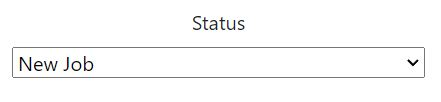

## Job Type

The **Job Type** is a flexible field configured by administrators. It serves to identify the nature of the job or to distinguish it from other roles within the company as needed. If this field is blank, please consult with the administration, as filling it out is necessary for job creation.

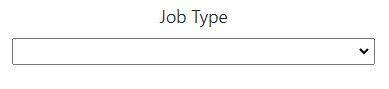

## Additional Fields

The fields presented below dynamically adjust, appearing or disappearing based on administrative preferences related to the logging of jobs, depending upon the specific **Client** and **Client Contract**. Whether these fields are visible or hidden, their necessity as mandatory or optional also varies in accordance with the **Client** and **Client Contract**.

Please see exmaple fields below

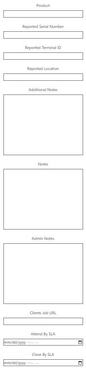

    
Automation Emails

    

        Job Creation: Notification Emails
        <ul>
            <li>Employees: After a job is created, an email will be sent to all users within the zones specified in the Site Details.</li>
            <li>Contractors: An email will be sent to the Contractor's Job Request Email as specified.</li>
        </ul>
    

    

        Job Allocation: Notification Email
        <ul>
            <li>An email will be sent to all users specified in the Allocation and/or Additional Resource sections. This email will notify the users that a job has been assigned to them.</li>
        </ul>
    

